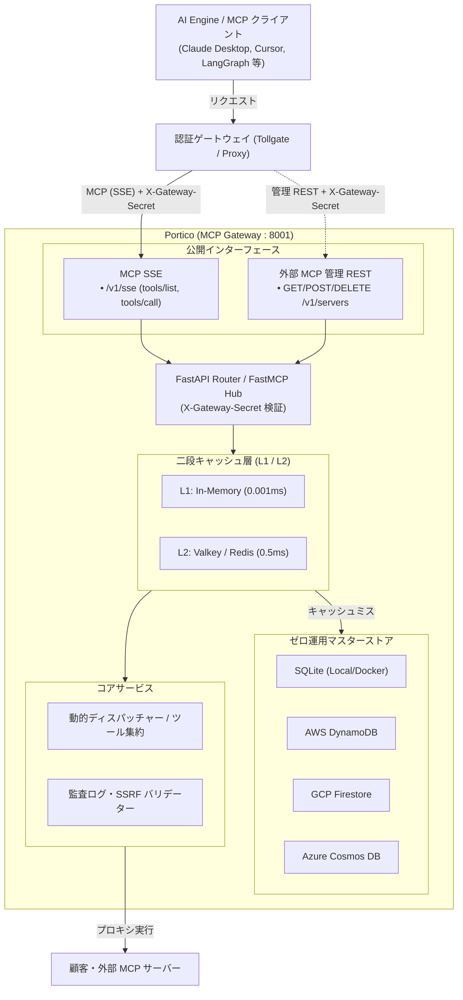

# Portico — MCP Gateway Integration Hub

[](https://www.python.org/)
[](https://fastapi.tiangolo.com/)
[](https://github.com/PrefectHQ/fastmcp)
[](https://www.sqlite.org/)
[](https://aws.amazon.com/dynamodb/)
[](https://valkey.io/)
[](https://prometheus.io/)
[](https://spec.openapis.org/oas/v3.1.0)
[](LICENSE)

**Portico** は、Model Context Protocol (MCP) をベースとしたマルチテナント向け実行ゲートウェイ・統合ハブである。  
AI Engine や MCP クライアント（Claude Desktop, Cursor, LangGraph 等）と外部ツール（SaaS、顧客・テナント独自の外部カスタム MCP サーバー等）を安全に仲介し、動的ルーティング・プロキシ実行・監査ログ記録を行う。

前段に [**Tollgate**](https://github.com/northfieldzz/tollgate)（APIキー管理・レート制限プロキシ）を配置し、`X-Gateway-Secret` によるゲートウェイ共有シークレット認証で連携することを前提としている（姉妹プロジェクト [**Kura**](https://github.com/northfieldzz/kura) と同様の信頼モデルを採用）。

---

## 目次

- [主な機能](#主な機能)
- [アーキテクチャ](#アーキテクチャ)
- [ディレクトリ構成](#ディレクトリ構成)
- [API エンドポイント一覧](#api-エンドポイント一覧)
- [環境変数設定](#環境変数設定)
- [クイックスタート](#クイックスタート)
- [API & MCP 利用例](#api--mcp-利用例)
- [テスト実行](#テスト実行)
- [詳細仕様書 & ガイド](#詳細仕様書--ガイド)
- [ライセンス](#ライセンス)

---

## 主な機能

- **MCP 標準準拠 (SSE ストリーミング)**:
  - `/v1/sse` にて Model Context Protocol (MCP) 標準に準拠した Server-Sent Events ストリーミングを提供。
  - ツール一覧の探索（`tools/list`）およびツール実行（`tools/call`）を MCP プロトコルで完全サポート。
- **外部カスタム MCP サーバー管理 & 動的ルーティング**:
  - テナントごとに独自の MCP サーバー（社内 Active Directory、オンプレミスシステム等）を動的に登録・削除・管理。
  - 外部サーバーのツール一覧を並列フェッチし、二段キャッシュで高速返却。
- **マルチクラウド・ゼロ運用ストレージ & 二段キャッシュ**:
  - **マスターストア**: SQLite（ローカル・単体運用）、AWS DynamoDB、GCP Cloud Firestore、Azure Cosmos DB をサポート（クラウド非依存）。
  - **二段キャッシュ**: プロセス内インメモリキャッシュ (L1) ＋ 分散 Valkey/Redis キャッシュ (L2) によりマイクロ秒レイテンシで応答。
- **セキュリティ & ガバナンス (Kura / Tollgate 準拠)**:
  - **Gateway 共有シークレット認証**: 前段ゲートウェイ（Tollgate 等）からのアクセスを `X-Gateway-Secret` の定数時間比較で相互信頼確認。
  - **無停止シークレットローテーション**: `GATEWAY_SHARED_SECRET_PREVIOUS` による新旧シークレットの並行受付。
  - **Fail-Fast な整合性検証**: クライアント指定テナントとプロキシ指定 `X-Tenant-ID` の不一致（コンフリクト）時は `403 Forbidden` で即座に遮断。
  - **SSRF 防止 & 安全性検証**: 外部 MCP サーバー登録時のプライベート IP・ループバック・クラウドメタデータ IP 遮断。
  - **内部シークレット保護**: `X-Internal-Secret` の定数時間比較（`secrets.compare_digest`）によるタイミング攻撃防御。
  - **暗号化キー本番バリデーション**: 外部認証情報を AES-256-GCM で暗号化保管。本番環境でのキー未設定による脆弱性抑止 (Fail-Fast)。
  - **構造化監査ログ**: ツール実行ごとの結果、実行時間、テナント情報を `portico.audit` に記録。
- **PoC・デモ用リファレンスツール**:
  - Slack（招待、メッセージ送信）、Google Workspace（アカウント作成、グループ追加）。
  - `MOCK_EXTERNAL_APIS=true` により、実 API クレデンシャル不要で安全にデモ実行可能。

---

## アーキテクチャ



---

## ディレクトリ構成

```text
portico/
├── compose.yaml              # Docker Compose 定義 (Portico + Valkey)
├── Dockerfile                # マルチステージビルド Dockerfile
├── pyproject.toml            # プロジェクト定義 & 依存関係 (Hatchling)
├── uv.lock                   # uv ロックファイル
├── .env.example              # 環境変数サンプル
├── CHANGELOG.md              # 変更履歴
├── SECURITY.md               # セキュリティポリシー
├── CONTRIBUTING.md           # コントリビューションガイド
├── docs/                     # 詳細仕様書
│   ├── 01_gateway_architecture.md
│   ├── 02_mcp_database_schema.md
│   ├── 03_builtin_tools_implementation.md
│   └── 04_custom_server_dispatch.md
├── src/
│   └── portico/
│       ├── main.py           # FastAPI エントリポイント & ライフサイクル
│       ├── api/              # API ルーティング & 依存性注入 (Gateway Secret / RLS)
│       │   ├── deps.py       # Gateway 共有シークレット検証、テナント検証
│       │   ├── router.py     # ルーター集約
│       │   └── routes/       # 各機能エンドポイント (servers, internal, ops)
│       ├── core/             # 設定管理、FastMCP ハブ
│       ├── cache/            # 二段キャッシュ (L1: In-Memory, L2: Valkey)
│       ├── storage/          # ゼロ運用ストレージ (SQLite, DynamoDB, Firestore, Cosmos DB)
│       ├── schemas/          # Pydantic スキーマ
│       ├── services/         # サーバー管理、ツールディスパッチ、監査ログ、暗号化
│       └── tools/            # テスト・PoC 用リファレンスツール (Slack / Google)
├── tests/                    # pytest 単体・統合テストスイート
└── README.md                 # 本ドキュメント
```

---

## API エンドポイント一覧

> [!IMPORTANT]
> **認証モデル (Kura / Tollgate 準拠)**:
> - **本番運用 (Gateway-Backed)**: 前段の Tollgate 等がエンドユーザーの API キー（`Authorization: Bearer <key>`）を認証・レート制限し、Portico へは共有シークレット `X-Gateway-Secret` およびテナントヘッダー（`X-Tenant-ID`, `X-Key-ID` 等）を付与して中継します。
> - **ローカル開発 / スタンドアロン**: `INSECURE_NO_GATEWAY_AUTH=true` を設定することで、シークレット検証をバイパスして直接リクエスト可能です。

### 1. MCP SSE ストリーミング (`/v1/sse`)
| メソッド | パス | 説明 | 認証・要件 |
|:---|:---|:---|:---|
| `GET` | `/v1/sse` | Model Context Protocol 準拠の SSE 接続エンドポイント（ツール探索・実行） | `X-Gateway-Secret` |
| `POST` | `/v1/messages` | MCP SSE セッション向け JSON-RPC メッセージ送信 | アクティブセッション |

### 2. 外部 MCP サーバー管理 (`/v1/servers`)
| メソッド | パス | 説明 | 認証・要件 |
|:---|:---|:---|:---|
| `GET` | `/v1/servers` | テナントに登録されている外部 MCP サーバー一覧取得 | `X-Gateway-Secret` |
| `POST` | `/v1/servers` | 新規外部 MCP サーバーの登録（疎通確認プローブ & SSRF 防御検証付き） | `X-Gateway-Secret` |
| `DELETE` | `/v1/servers/{server_id}` | 外部 MCP サーバーの登録解除 | `X-Gateway-Secret` |

### 3. 内部サービス専用 API (`/v1/internal`)
| メソッド | パス | 説明 | 認証・要件 |
|:---|:---|:---|:---|
| `DELETE` | `/v1/internal/tenants/{tenant_id}` | テナント削除時の外部 MCP サーバー一括削除クリーンアップ | `X-Internal-Secret` |

### 4. 運用 & オブザーバビリティ
| メソッド | パス | 説明 |
|:---|:---|:---|
| `GET` | `/livez` (`/health/live`) | **Liveness プローブ** (プロセスの死活監視、即座に 200 返却) |
| `GET` | `/readyz` (`/health/ready`) | **Readiness プローブ** (ストレージ疎通確認、受付準備完了判定) |
| `GET` | `/health` | **総合ヘルスチェック** (プロセス生存 + ストレージ疎通状態) |
| `GET` | `/metrics` | **Prometheus メトリクス** (ツール実行数、レイテンシ等) |
| `GET` | `/v1/openapi.json` | OpenAPI 3.1 仕様 JSON |

---

## 環境変数設定

主要な環境変数（詳細は [`.env.example`](.env.example) を参照）：

| 変数名 | デフォルト値 | 必須 | 説明 |
|:---|:---|:---:|:---|
| `ENVIRONMENT` | `development` | 任意 | 実行環境 (`development` / `production`) |
| `GATEWAY_SHARED_SECRET` | *(未設定)* | 本番必須 | ゲートウェイ共有シークレット (32文字以上。本番環境で未設定時は起動時エラー) |
| `GATEWAY_SHARED_SECRET_PREVIOUS` | *(未設定)* | 任意 | シークレットローテーション移行期間用の旧シークレット |
| `GATEWAY_SECRET_HEADER` | `X-Gateway-Secret` | 任意 | シークレットを受け取るヘッダー名 |
| `INSECURE_NO_GATEWAY_AUTH` | `false` | 任意 | `true` の場合、シークレット検証をバイパス (開発・検証専用) |
| `STORAGE_BACKEND` | `sqlite` | 任意 | マスターストア種別 (`sqlite` / `dynamodb` / `firestore` / `cosmosdb` / `memory`) |
| `SQLITE_DB_PATH` | `portico.db` | 任意 | SQLite データベースファイルパス |
| `CACHE_LAYER` | `two_tier` / `memory` | 任意 | キャッシュ階層 (`two_tier` / `memory` / `valkey` / `none`) |
| `VALKEY_URL` | `redis://localhost:6379/0` | 任意 | 分散キャッシュ Valkey / Redis 接続 URL |
| `CACHE_L1_TTL_SECONDS` | `30` | 任意 | L1 インメモリキャッシュ保持秒数 |
| `CACHE_L2_TTL_SECONDS` | `300` | 任意 | L2 分散キャッシュ保持秒数 |
| `MOCK_EXTERNAL_APIS` | `true` | 任意 | `true` の場合、実 SaaS を呼ばずにモック応答を返却 |
| `ALLOW_LOCAL_MCP_SERVERS` | `true` (dev) / `false` (prod) | 任意 | ローカル / プライベート IP への外部 MCP サーバー登録可否 |
| `INTERNAL_SERVICE_SECRET` | *(未設定時ランダム生成)* | 推奨 | 内部サービス間専用通信シークレット (`X-Internal-Secret` 照合用) |
| `SECRET_ENCRYPTION_KEY` | *(未設定時ランダム生成)* | 本番必須 | 外部サーバー認証情報の AES-256 暗号化キー。本番環境で未設定時は起動時エラー (Fail-Fast) |
| `LOG_LEVEL` | `INFO` | 任意 | ログ出力レベル (`DEBUG`, `INFO`, `WARNING`, `ERROR`) |

---

## クイックスタート

### 前提条件
- Docker & Docker Compose
- （ローカル実行時）Python 3.14+ および [uv](https://github.com/astral-sh/uv)

### 1. Docker Compose での起動 (Valkey 二段キャッシュ付き)

```bash
# 1. 環境変数の準備
cp .env.example .env

# 2. コンテナ起動 (Portico + Valkey)
docker compose up -d --build

# 3. ログ確認
docker compose logs -f portico

# 4. ヘルスチェック確認
curl -i http://localhost:8001/livez
curl -i http://localhost:8001/readyz
```

- **Portico ゲートウェイ**: `http://localhost:8001`
- **OpenAPI 仕様**: `http://localhost:8001/v1/openapi.json`

### 2. ローカル環境での起動 (uv, ゼロ依存 SQLite)

```bash
# 1. 依存関係のインストール (基本: SQLite / Valkey)
uv sync

# (任意) クラウド専用 SDK の追加インストール
# AWS DynamoDB:    pip install "portico[dynamodb]"    (uv add "portico[dynamodb]")
# GCP Firestore:   pip install "portico[firestore]"   (uv add "portico[firestore]")
# Azure Cosmos DB: pip install "portico[cosmos]"      (uv add "portico[cosmos]")
# 全クラウド対応:   pip install "portico[all]"         (uv add "portico[all]")

# 2. アプリケーション起動
uv run uvicorn portico.main:app --host 0.0.0.0 --port 8001 --reload
```

---

## API & MCP 利用例

### ① 外部 MCP サーバーの登録 (`POST /v1/servers`)

外部の MCP サーバーをテナント向けに登録する。エンドポイントの生存確認（`tools/list` プローブ）と SSRF バリデーションが自動実行される。

```bash
curl -X POST http://localhost:8001/v1/servers \
  -H "X-Gateway-Secret: your_gateway_shared_secret" \
  -H "X-Tenant-ID: tenant_demo" \
  -H "Content-Type: application/json" \
  -d '{
    "name": "Internal ActiveDirectory MCP",
    "url": "https://mcp-ad.internal.example.com/sse",
    "auth_type": "bearer",
    "auth_token": "eyJhbGciOi...",
    "scopes": ["admin:*", "users:read"]
  }'
```

### ② 外部 MCP サーバー一覧の取得 (`GET /v1/servers`)

```bash
curl -X GET http://localhost:8001/v1/servers \
  -H "X-Gateway-Secret: your_gateway_shared_secret" \
  -H "X-Tenant-ID: tenant_demo"
```

### ③ MCP クライアント連携 (`/v1/sse`)

Claude Desktop や Cursor、LangGraph の MCP 設定に追加することで、統合された全ツールへアクセス可能。

#### Claude Desktop 設定例 (`claude_desktop_config.json`)

```json
{
  "mcpServers": {
    "portico": {
      "url": "http://localhost:8001/v1/sse",
      "headers": {
        "X-Gateway-Secret": "your_gateway_shared_secret",
        "X-Tenant-ID": "tenant_demo"
      }
    }
  }
}
```

#### LangGraph / Python クライアント例

```python
from mcp.client.sse import sse_client
from mcp.client.session import ClientSession

headers = {
    "X-Gateway-Secret": "your_gateway_shared_secret",
    "X-Tenant-ID": "tenant_demo",
}

async with sse_client("http://localhost:8001/v1/sse", headers=headers) as (read, write):
    async with ClientSession(read, write) as session:
        await session.initialize()
        tools = await session.list_tools()
        print(f"利用可能なツール数: {len(tools.tools)}")
```

---

## テスト実行

```bash
# 全テスト実行
uv run pytest

# キャッシュを無視して詳細実行
uv run pytest -v -o cache_dir=.pytest_cache

# カバレッジレポート出力
uv run pytest --cov=portico
```

---

## 詳細仕様書 & ガイド

- [01. アーキテクチャ & FastMCP ハブ仕様書 (docs/01_gateway_architecture.md)](docs/01_gateway_architecture.md)
- [02. マルチクラウド・ゼロ運用ストレージ & 二段キャッシュ仕様書 (docs/02_mcp_database_schema.md)](docs/02_mcp_database_schema.md)
- [03. テスト・デモ用リファレンスツール実装仕様書 (docs/03_builtin_tools_implementation.md)](docs/03_builtin_tools_implementation.md)
- [04. 外部カスタム MCP サーバー管理 & 動的ディスパッチ仕様書 (docs/04_custom_server_dispatch.md)](docs/04_custom_server_dispatch.md)
- [コントリビューションガイド (CONTRIBUTING.md)](CONTRIBUTING.md)
- [セキュリティポリシー (SECURITY.md)](SECURITY.md)
- [変更履歴 (CHANGELOG.md)](CHANGELOG.md)

---

## ライセンス

本プロジェクトは [Mozilla Public License 2.0 (MPL-2.0)](LICENSE) の下で公開されています。
