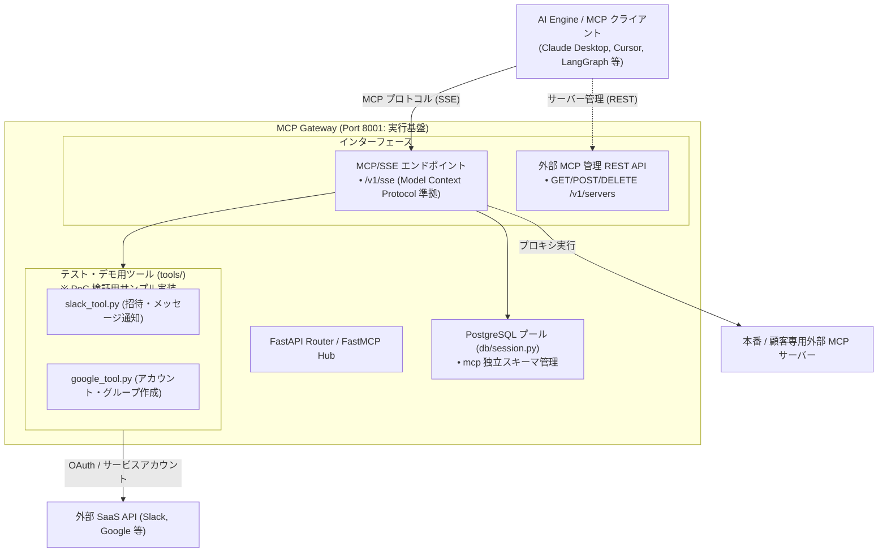
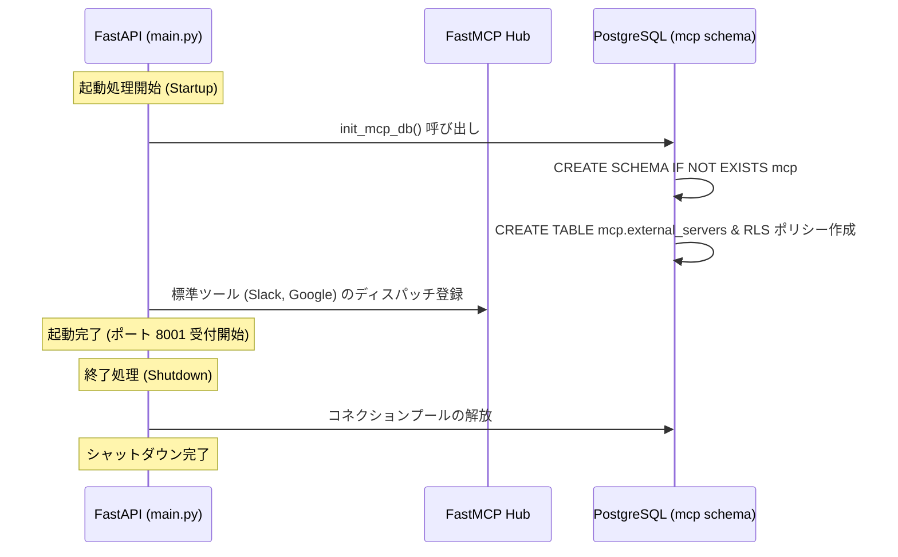

# Portico — アーキテクチャ & FastMCP ハブ仕様書

本ドキュメントは、Portico におけるサービス構造、FastAPI と FastMCP の統合設計、提供エンドポイント、および起動ライフサイクルについて定義する。

---

## 1. サービス概要とアーキテクチャ

MCP Gateway は、AI Engine からの指示を受け取り、実際の外部 SaaS や社内システムへの安全な API 呼び出しを行う実行レイヤーである。

---

## 2. インターフェース設計

MCP Gateway は、ツール探索・実行を MCP プロトコルに一本化し、管理用 API を REST で提供する。

1. **MCP / SSE エンドポイント (`/v1/sse`)**:
   - Model Context Protocol (MCP) 標準に準拠した Server-Sent Events (SSE) ストリーミングインターフェース。
   - ツール一覧取得（`tools/list`）およびツール実行（`tools/call`）を処理。
   - `X-Gateway-Secret` 共有シークレット認証（新旧ローテーション対応）および Tollgate 連携ヘッダー透過に対応。
2. **外部 MCP サーバー管理 REST API (`/v1/servers`)**:
   - テナント別の外部 MCP サーバー登録・一覧・削除を行う管理インターフェース。

---

## 3. アプリケーションライフサイクル (`lifespan`)

`main.py` の起動時処理において、以下が実行される。

---

## 4. 環境変数マッピング (`core/config.py`)

MCP Gateway が利用する環境変数一覧。

| 環境変数名 | デフォルト値 | 説明 |
|------------|--------------|------|
| `ROOT_PATH` | `/gateway` | リバースプロキシ（Nginx / ALB）配下用のルートパス |
| `LOG_LEVEL` | `INFO` | ログ出力レベル (`DEBUG`, `INFO`, `WARNING`, `ERROR`) |
| `MOCK_EXTERNAL_APIS` | `true` | `true` の場合、外部 SaaS を実際に叩かずモックレスポンスを返却 |
| `POSTGRES_URL` | `postgresql://...` | PostgreSQL 接続 URL (asyncpg) |
