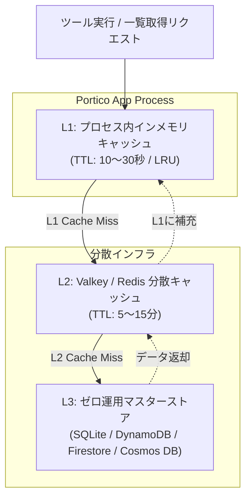

# Portico — マルチクラウド・ゼロ運用ストレージ & 二段キャッシュ仕様書

本ドキュメントは、Portico（MCP Gateway）におけるゼロ運用マスターストア（SQLite / DynamoDB / Firestore / Cosmos DB）の統一データモデル、および二段キャッシュ（L1: In-Memory + L2: Valkey/Redis）のアーキテクチャについて定義する。

---

## 目次

- [1. 永続化 & キャッシュの設計方針](#1-永続化--キャッシュの設計方針)
- [2. 二段キャッシュ (L1/L2) アーキテクチャ](#2-二段キャッシュ-l1l2-アーキテクチャ)
- [3. 各マスターストアのデータモデル](#3-各マスターストアのデータモデル)
  - [3-1. SQLite (ローカル / CI / 単体コンテナ)](#3-1-sqlite-ローカル--ci--単体コンテナ)
  - [3-2. AWS DynamoDB (AWS サーバーレス)](#3-2-aws-dynamodb-aws-サーバーレス)
  - [3-3. GCP Cloud Firestore (GCP サーバーレス)](#3-3-gcp-cloud-firestore-gcp-サーバーレス)
  - [3-4. Azure Cosmos DB (Azure サーバーレス)](#3-4-azure-cosmos-db-azure-サーバーレス)
- [4. 暗号化 & テナント分離](#4-暗号化--テナント分離)

---

## 1. 永続化 & キャッシュの設計方針

Portico はクラウド非依存のマイクロサービスとして、特定の RDBMS（PostgreSQL等）に依存せず、**「各クラウドネイティブなゼロ運用 NoSQL + ゼロ依存 SQLite」** をマスターストアとして採用する。

- **サーバーレス・ゼロ運用**:
  - AWS、GCP、Azure の各環境で接続プール枯渇やインスタンス管理が不要なサーバーレス NoSQL を利用可能。
- **ローカル・単体運用の手軽さ**:
  - 外部ミドルウェア不要な SQLite（ファイルまたは `:memory:`）により、単一バイナリ/コンテナで即座に動作。
- **二段キャッシュによるマイクロ秒応答**:
  - プロセス内インメモリキャッシュ（L1）と分散 Valkey/Redis キャッシュ（L2）を併用し、ツール実行時の DB 負荷を極小化。

---

## 2. 二段キャッシュ (L1/L2) アーキテクチャ



- **読み取りフロー**:
  1. L1（In-Memory）を探索（0.001ms）
  2. L1 ミス時、L2（Valkey/Redis）を探索（0.5ms）し、L1 にキャッシュ補充
  3. L2 ミス時、マスターストア（L3）から読み出し、L2 および L1 の双方にキャッシュ補充
- **書き込み・更新・削除フロー**:
  - マスターストアへ書き込み後、L2 を更新/削除し、全インスタンスの L1 を無効化（または短時間 TTL で自動破棄）。

---

## 3. 各マスターストアのデータモデル

### 3-1. SQLite (ローカル / CI / 単体コンテナ)

テーブル `portico_custom_servers`:

```sql
CREATE TABLE IF NOT EXISTS portico_custom_servers (
    id TEXT NOT NULL,
    tenant_id TEXT NOT NULL,
    name TEXT NOT NULL,
    url TEXT NOT NULL,
    status TEXT NOT NULL DEFAULT 'active',
    auth_type TEXT NOT NULL DEFAULT 'none',
    encrypted_auth_config TEXT,
    scopes TEXT DEFAULT '[]',
    created_at TEXT NOT NULL,
    updated_at TEXT NOT NULL,
    PRIMARY KEY (tenant_id, id)
);

CREATE UNIQUE INDEX IF NOT EXISTS uq_portico_custom_servers_tenant_url 
ON portico_custom_servers (tenant_id, url);
```

### 3-2. AWS DynamoDB (AWS サーバーレス)

Kura 互換の 1 テーブル設計を採用。

| 属性名 | 型 | キー種別 | 説明 |
|:---|:---:|:---:|:---|
| `PK` | String | **Partition Key** | `TENANT#<tenant_id>` |
| `SK` | String | **Sort Key** | `SERVER#<server_id>` |
| `id` | String | Attribute | サーバー識別子 (`ext-...`) |
| `tenant_id` | String | Attribute | テナント識別子 |
| `name` | String | Attribute | サーバー表示名 |
| `url` | String | Attribute | SSE エンドポイント URL |
| `status` | String | Attribute | `active` / `connected` |
| `auth_type` | String | Attribute | `none` / `bearer` / `api_key` / `custom` |
| `encrypted_auth_config` | String | Attribute | AES-256-GCM 暗号化済み認証ヘッダー |
| `scopes` | StringSet | Attribute | 認可スコープ一覧 |
| `created_at` | String | Attribute | ISO 8601 作成日時 |
| `updated_at` | String | Attribute | ISO 8601 更新日時 |

### 3-3. GCP Cloud Firestore (GCP サーバーレス)

- **コレクション**: `portico_servers`
- **ドキュメント ID**: `<tenant_id>_<server_id>`
- **フィールド**: `id`, `tenant_id`, `name`, `url`, `status`, `auth_type`, `encrypted_auth_config`, `scopes` (Array), `created_at`, `updated_at`

### 3-4. Azure Cosmos DB (Azure サーバーレス)

- **データベース**: `portico_db`
- **コンテナ**: `portico_servers` (パーティションキー: `/tenant_id`)
- **ドキュメント ID**: `<tenant_id>_<server_id>`

---

## 4. 暗号化 & テナント分離

- **機密情報の暗号化 (AES-256-GCM)**:
  - 外部 MCP サーバーへの接続トークンや API キーは、マスターストアに平文で保存されることはない。`ENCRYPTION_MASTER_KEY`（32バイト Base64）を用いて暗号化（`encrypted_auth_config`）された状態で保管される。
- **完全なマルチテナント分離**:
  - 全てのクエリ・更新操作は `tenant_id` をキーとして実行され、他テナントのカスタムサーバー定義や認証情報へアクセスすることはできない。
