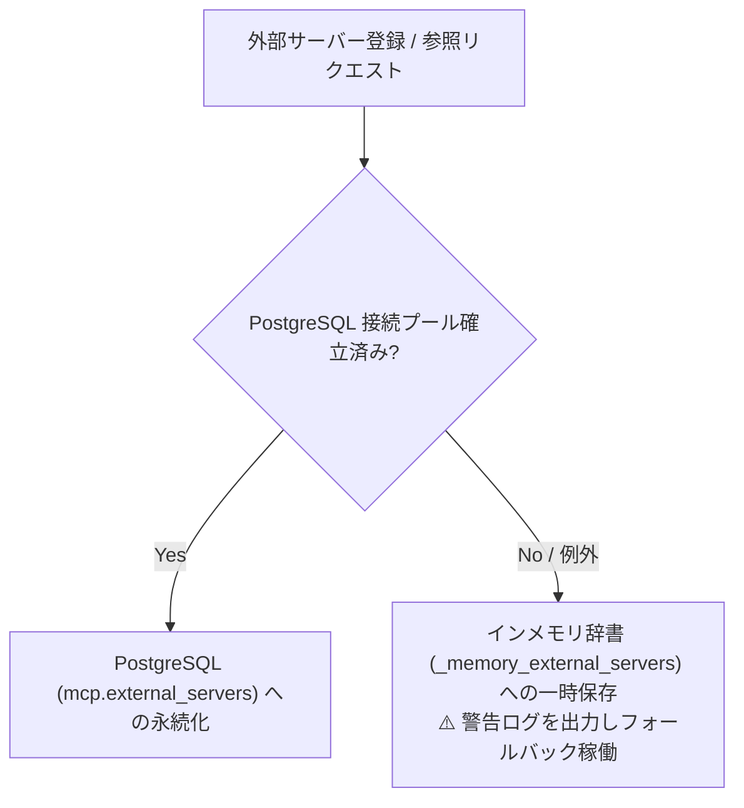

# MCP Gateway — PostgreSQL `mcp` スキーマ & 永続化仕様書

本ドキュメントは、MCP Gateway が独自に保持・管理する PostgreSQL 独立スキーマ `mcp`、テーブル構造、Row Level Security (RLS) によるテナント分離、およびインメモリフォールバック動作について定義する。

---

## 1. 独立スキーマ `mcp` の設計方針

MCP Gateway はマイクロサービスとしての自律性を担保するため、AI Engine のテーブル群とは切り離された **`mcp` スキーマ** を自己管理する。

- **スキーマの自己初期化 (`db/session.py`)**:
  - アプリケーション起動時に `init_mcp_db()` が自動実行され、スキーマおよびテーブルが存在しない場合は `CREATE SCHEMA IF NOT EXISTS mcp` により自動構築される。
- **分離のメリット**:
  - 本番 AWS 環境において、将来的に MCP Gateway 専用の独立した RDS / Aurora インスタンスへ物理分離することが容易。

---

## 2. テーブル定義 (`mcp.external_servers`)

各テナントが持ち込んだ外部カスタム MCP サーバーの接続情報を保持する。

```sql
CREATE SCHEMA IF NOT EXISTS mcp;

CREATE TABLE IF NOT EXISTS mcp.external_servers (
    id VARCHAR PRIMARY KEY,
    tenant_id VARCHAR NOT NULL,
    name VARCHAR NOT NULL,
    url VARCHAR NOT NULL,
    status VARCHAR NOT NULL DEFAULT 'active',
    last_synced_at TIMESTAMPTZ,
    created_at TIMESTAMPTZ DEFAULT NOW(),
    updated_at TIMESTAMPTZ DEFAULT NOW()
);

-- 同一テナント内での同一 URL 重複登録を防止
CREATE UNIQUE INDEX IF NOT EXISTS uq_mcp_external_servers_tenant_url 
ON mcp.external_servers (tenant_id, url);
```

### カラム詳細

| カラム名 | 型 | 制約 | 説明 |
|----------|----|------|------|
| `id` | VARCHAR | PRIMARY KEY | 外部サーバーの一意識別子 (`ext_mcp_...`) |
| `tenant_id` | VARCHAR | NOT NULL | 所有するテナント ID |
| `name` | VARCHAR | NOT NULL | 表示名称（例: "社内 ActiveDirectory MCP"） |
| `url` | VARCHAR | NOT NULL | 外部サーバーのエンドポイント URL (`https://.../sse`) |
| `status` | VARCHAR | DEFAULT 'active'| 状態 (`active`, `unreachable`, `error`) |
| `last_synced_at` | TIMESTAMPTZ | NULL | ツール一覧を取得・同期した最終日時 |
| `created_at` | TIMESTAMPTZ | DEFAULT NOW() | 登録日時 |
| `updated_at` | TIMESTAMPTZ | DEFAULT NOW() | 更新日時 |

---

## 3. テナント分離 (Row Level Security: RLS)

マルチテナント環境において、他社の外部 MCP サーバー設定を閲覧・更新・削除できないよう、PostgreSQL の RLS ポリシーを適用している。

```sql
ALTER TABLE mcp.external_servers ENABLE ROW LEVEL SECURITY;

DROP POLICY IF EXISTS mcp_external_servers_tenant_isolation ON mcp.external_servers;

CREATE POLICY mcp_external_servers_tenant_isolation ON mcp.external_servers
  FOR ALL
  USING (
    tenant_id = current_setting('app.current_tenant_id', true)
    OR current_setting('app.current_tenant_id', true) IS NULL
    OR current_setting('app.current_tenant_id', true) = ''
  );
```

- **セッション変数の設定**:
  - API 呼び出し時に、認証されたテナント ID を `SET LOCAL app.current_tenant_id = '<tenant_id>'` で設定し、ポリシーに基づき自テナントのレコードのみがフィルタリングされる。

---

## 4. インメモリフォールバック動作 (Resilience)

PostgreSQL が一時的にオフラインまたは接続不可の場合、サービス停止を回避するため `db/session.py` は自動的にインメモリ辞書（`_memory_external_servers`）にフォールバックする。


これにより、開発中の DB 再起動時や障害発生時でも、API がクラッシュすることなく安全に縮退稼働する。
