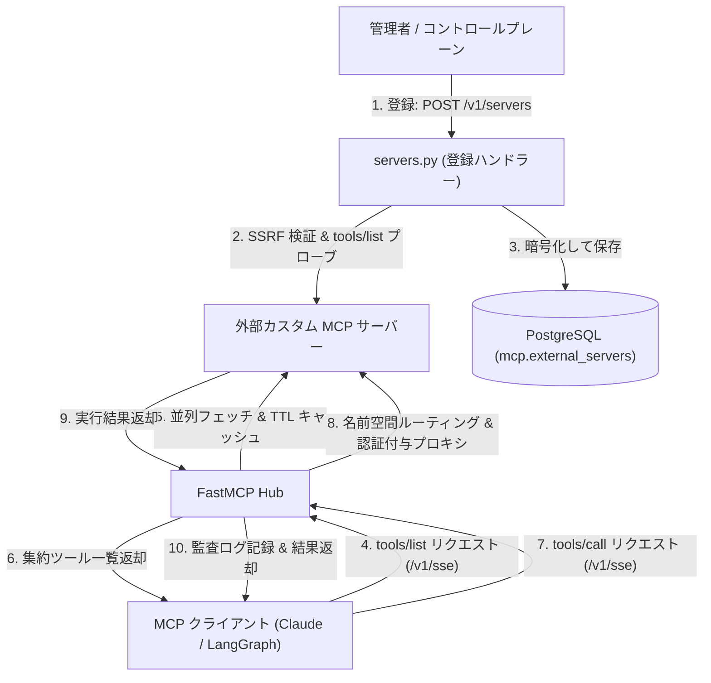

# Portico — 外部カスタム MCP サーバー管理 & 動的ディスパッチ仕様書

本ドキュメントは、Portico（MCP Gateway）において顧客やパートナー企業が持ち込んだ独自の外部カスタム MCP サーバー（オンプレミス Active Directory、社内購買システム等）を動的に登録・管理し、MCP プロトコル経由で安全にディスパッチ・プロキシ実行する仕様について定義する。

---

## 目次

- [1. 外部 MCP サーバーの統合アーキテクチャ](#1-外部-mcp-サーバーの統合アーキテクチャ)
- [2. 外部サーバー管理 API (api/routes/servers.py)](#2-外部サーバー管理-api-apiroutesserverspy)
  - [2.1. サーバー登録 (POST /v1/servers)](#21-サーバー登録-post-v1servers)
  - [2.2. サーバー一覧取得 (GET /v1/servers)](#22-サーバー一覧取得-get-v1servers)
  - [2.3. サーバー削除 (DELETE /v1/servers/{server_id})](#23-サーバー削除-delete-v1serversserver_id)
- [3. 動的ツール集約とキャッシュ管理](#3-動的ツール集約とキャッシュ管理)
- [4. 動的ディスパッチ (Dynamic Dispatch) 処理](#4-動的ディスパッチ-dynamic-dispatch-処理)

---

## 1. 外部 MCP サーバーの統合アーキテクチャ

MCP Gateway は、標準組み込みツール（Slack, Google）だけでなく、外部ネットワーク上のカスタム MCP サーバー（SSE / HTTP）に対するリバースプロキシおよび動的ディスパッチャーとして機能する。



---

## 2. 外部サーバー管理 API (`api/routes/servers.py`)

### 2.1. サーバー登録 (`POST /v1/servers`)
- **ヘッダー**: `X-Gateway-Secret`, `X-Tenant-ID`
- **リクエスト**:
  ```json
  {
    "name": "社内 Active Directory 連携 MCP",
    "url": "https://ad-mcp.internal.company.com/sse",
    "auth_type": "bearer",
    "auth_token": "secret-token-xyz",
    "scopes": ["ad:read", "ad:write"]
  }
  ```
- **処理**:
  1. SSRF バリデーターによるホスト検証（プライベート IP、ループバック、クラウドメタデータ IP 遮断）。
  2. `url` に対する疎通確認プローブ（`tools/list`）を実施。
  3. 認証トークンを AES-256 で暗号化し、`mcp.external_servers` に `status='active'` で保存。

### 2.2. サーバー一覧取得 (`GET /v1/servers`)
- 自テナント（RLS スコープ内）に登録されている外部 MCP サーバーの一覧とステータスを返却。

### 2.3. サーバー削除 (`DELETE /v1/servers/{server_id}`)
- 対象サーバーの登録を解除し、関連するツール定義のキャッシュを無効化。

---

## 3. 動的ツール集約とキャッシュ管理

外部 MCP サーバーが提供するツールの定義・引数スキーマは、クライアントからの接続時に動的に集約される。

1. **名前空間による競合回避**:
   - 外部サーバーのツール名は `{server_slug}__{tool_name}` 形式（例: `ad_mcp__user_search`）で名前空間が付与され、ツール名の衝突を防止。
2. **TTL インメモリキャッシュ**:
   - 外部サーバーからのツール一覧取得結果は `TOOL_CACHE_TTL_SECONDS`（既定: 60秒）間キャッシュされ、高頻度アクセス時の外部オーバーヘッドを低減。

---

## 4. 動的ディスパッチ (Dynamic Dispatch) 処理

MCP クライアントから `tools/call` がリクエストされた際、Portico は以下の順序でディスパッチを解決する。

1. **標準ツールテーブルの確認**:
   - `slack_invite_user`, `google_create_account` などの組み込みツールであれば、該当 Python 関数を即時実行。
2. **外部サーバーのルーティング解決**:
   - 名前空間プレフィックスまたは登録済みツール一覧から対象の外部 MCP サーバーを特定。
3. **認証ヘッダー付与 & プロキシ実行**:
   - 保存された認証トークンを復号し、対象の外部 MCP サーバーへ `httpx.AsyncClient` で安全にプロキシ転送。
4. **監査ログ記録 (portico.audit)**:
   - 実行成否、処理時間、テナント ID、キー ID を監査ログとして記録し、結果を MCP プロトコルでクライアントへ返却。
