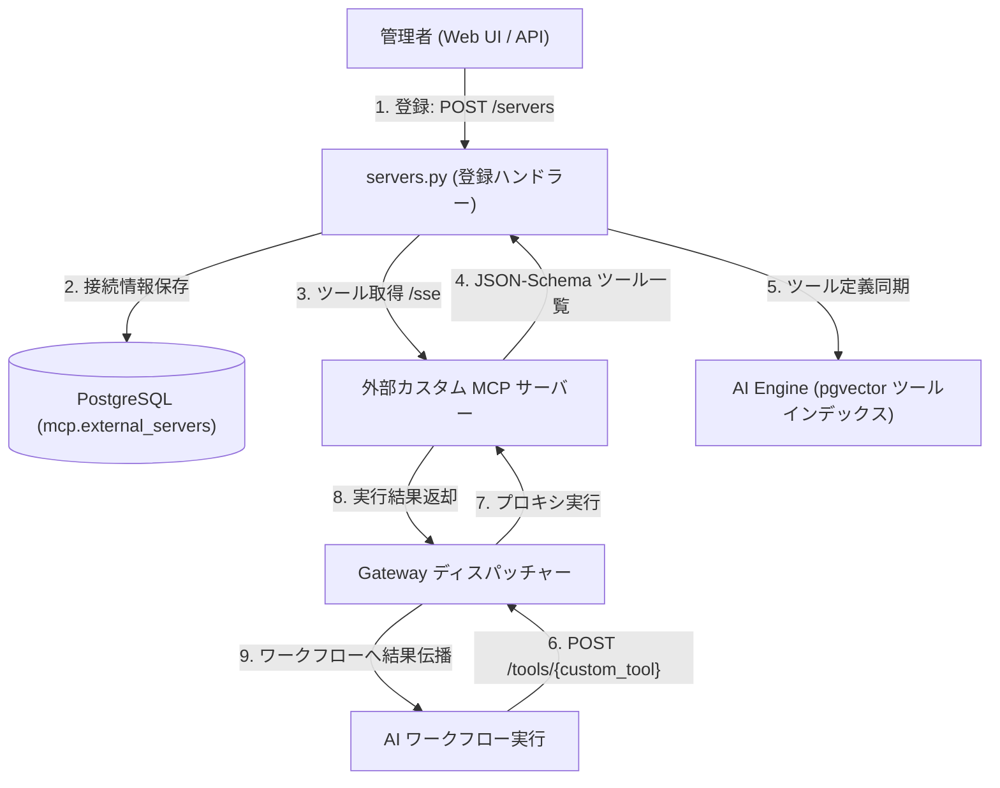

# MCP Gateway — 外部カスタム MCP サーバー管理 & 動的ディスパッチ仕様書

本ドキュメントは、顧客やパートナー企業が持ち込んだ独自の MCP サーバー（オンプレミス Active Directory、社内購買システム等）を MCP Gateway に動的統合・ルーティングする仕様を定義する。

---

## 1. 外部 MCP サーバーの統合アーキテクチャ

MCP Gateway は、標準組み込みツール（Slack, Google）だけでなく、外部ネットワーク上の MCP/SSE サーバーに対するリバースプロキシおよびディスパッチャーとして機能する。



---

## 2. 外部サーバー管理 API (`api/routes/servers.py`)

### 2.1. サーバー登録 (`POST /servers`)
- **リクエスト**:
  ```json
  {
    "name": "社内 Active Directory 連携 MCP",
    "url": "https://ad-mcp.internal.company.com/sse"
  }
  ```
- **処理**:
  1. `url` に対して GET / SSE 疎通確認を行い、応答があるかヘルスチェックを実施。
  2. 疎通成功時、`mcp.external_servers` に `status='active'` で保存。
  3. ツール定義を取得し、`last_synced_at` を更新。

### 2.2. サーバー一覧取得 (`GET /servers`)
- 自テナント（RLS スコープ内）に登録されている外部 MCP サーバーの一覧とステータスを返却。

### 2.3. サーバー削除 (`DELETE /servers/{server_id}`)
- 対象サーバーの登録を解除し、関連するツール定義の参照を無効化。

---

## 3. ツール同期の運用タイミング（全 3 パターン）

外部 MCP サーバーが提供するツールの定義・引数スキーマは、以下の 3 つの契機で自動的に AI Engine の pgvector ベクトルインデックスへ同期される。

| タイミング | トリガー種別 | 実行主体 | 処理内容 |
|------------|--------------|----------|----------|
| **① サーバー登録・削除時** | イベント駆動 (即時) | MCP Gateway (`server_service.py`) | 登録 (`POST /servers`) または削除時に、AI Engine の `/api/v1/tools/sync` を即時呼び出して差分反映 |
| **② 1時間ごとの定期同期** | 定期バッチ (自動) | AI Engine (`_background_tool_sync_loop`) | 外部 MCP サーバー側のツール仕様変更・追加を自動追従するため、1時間（3600秒）ごとに Gateway から一括再取得・更新 |
| **③ AI Engine 起動時** | サービス初期化 | AI Engine (`lifespan`) | コンテナ起動時に `sync_all_tools()` を実行し、既存サーバーの全ツールインデックスを初期構築 |

---

## 4. 動的ディスパッチ (Dynamic Dispatch) 処理

AI Engine から `POST /tools/{tool_name}` がリクエストされた際、MCP Gateway は以下の順序でディスパッチを解決する。

1. **標準ツールテーブルの確認**:
   - `slack_invite_user`, `google_create_account` などの標準ツールであれば、該当 Python 関数を即時実行。
2. **外部サーバー登録テーブルの検索**:
   - 標準ツールに存在しない場合、自テナントのアクティブな外部 MCP サーバーから該当ツールを提供する接続先 URL を特定。
3. **外部プロキシ実行**:
   - `httpx.AsyncClient` または MCP SDK クライアントを用いて外部サーバーへ RPC リクエストを中継。
4. **フォールバック & エラーハンドリング**:
   - 外部サーバーがタイムアウト（30秒超過）または HTTP 5xx を返した場合、`UPSTREAM_TOOL_FAILED` エラーコードとともに詳細ログを返却。
